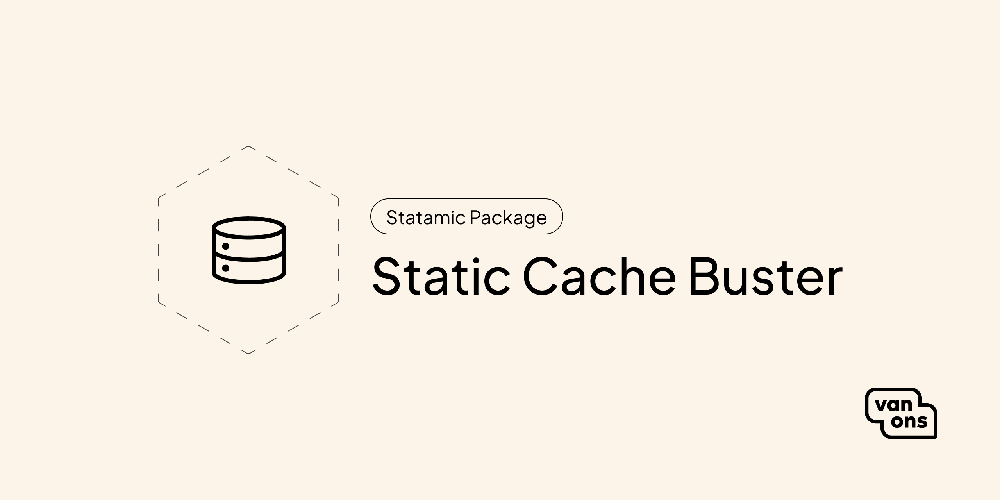

<p align="center"></p>

# Statamic Static Cache Buster

<!-- BADGES -->

Plugin for Statamic that expands the standard cache validation to invalidate the static cache of all relevant URLs.

## Quick start

### Requirements

| Dependency | Minimum version |
|------------|-----------------|
| PHP        | 8.0             |
| Laravel    | 10.0            |
| Statamic   | 5.0             |

### Installation

```bash
composer require van-ons/statamic-static-cache-buster
```

### Usage

Once installed, you simply need to use the buster class in Statamic's static cache invalidation configuration:

```php
'invalidation' => [
    'class' => VanOns\StatamicStaticCacheBuster\StaticCaching\Buster::class,
],
```

And you will immediately get the full power of the static cache busting.

## Documentation

Please see the [documentation] for detailed information about functionality and configuration.

## Contributing

Please see [contributing] for more information about how you can contribute.

## Changelog

Please see [changelog] for more information about what has changed recently.

## Upgrading

Please see [upgrading] for more information about how to upgrade.

## Security

Please see [security] for more information about how we deal with security.

## Credits

We would like to thank the following contributors for their contributions to this project:

- [All Contributors][all-contributors]

## License

The scripts and documentation in this project are released under the [MIT License][license].

---

<p align="center"><a href="https://van-ons.nl/" target="_blank"></a></p>

[documentation]: docs

[contributing]: CONTRIBUTING.md

[changelog]: CHANGELOG.md

[upgrading]: UPGRADING.md

[security]: SECURITY.md

[email]: mailto:opensource@van-ons.nl

[all-contributors]: ../../contributors

[license]: LICENSE.md
